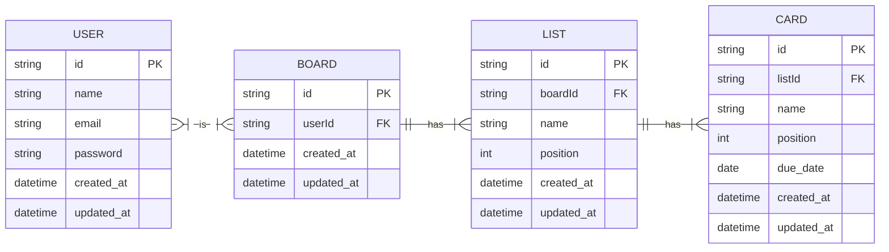

```mermaid
  erDiagram
  direction LR

  USER {
    string id PK
    string name
    string email
    string password
    datetime created_at
    datetime updated_at
  }

  BOARD {
    string id PK
    string userId FK
    datetime created_at
    datetime updated_at
  }

  LIST {
    string id PK
    string boardId FK
    string name
    int position
    datetime created_at
    datetime updated_at
  }

  CARD {
    string id PK
    string listId FK
    string name
    int position
    date due_date
    datetime created_at
    datetime updated_at
  }

  USER }|..|{ BOARD: is
  BOARD ||--|{ LIST: has
  LIST ||--|{ CARD: has
```
