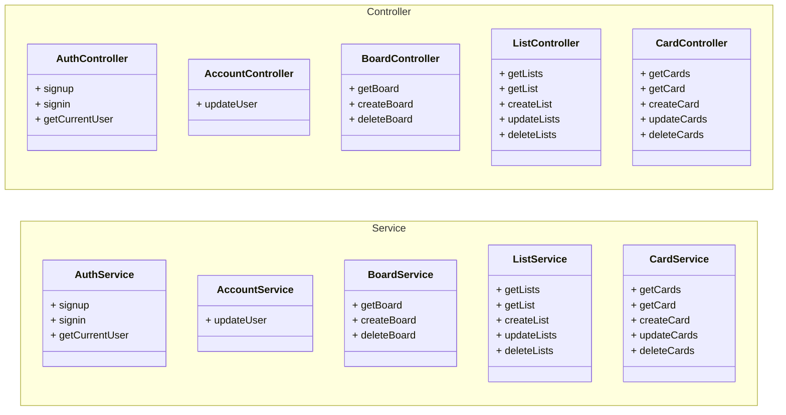

```mermaid
  classDiagram
  direction LR

    namespace Controller {
      class AuthController {
        + signup
        + signin
        + getCurrentUser
      }
      class AccountController {
        + updateUser
      }
      class BoardController {
        + getBoard
        + createBoard
        + deleteBoard
      }
      class ListController {
        + getLists
        + getList
        + createList
        + updateLists
        + deleteLists
      }
      class CardController {
        + getCards
        + getCard
        + createCard
        + updateCards
        + deleteCards
      }
    }

    namespace Service {
      class AuthService {
        + signup
        + signin
        + getCurrentUser
      }
      class AccountService {
        + updateUser
      }
      class BoardService {
        + getBoard
        + createBoard
        + deleteBoard
      }
      class ListService {
        + getLists
        + getList
        + createList
        + updateLists
        + deleteLists
      }
      class CardService {
        + getCards
        + getCard
        + createCard
        + updateCards
        + deleteCards
      }
    }
```
