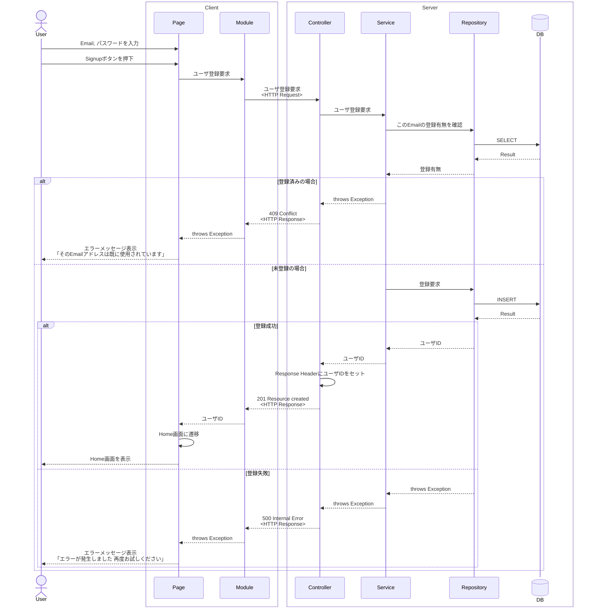

```mermaid
sequenceDiagram

  actor User
  box Client
    participant Page
    participant Module
  end
  box Server
    participant Controller
    participant Service
    participant Repository
    participant DB@{ "type": "database" }
  end

  User ->> Page: Email, パスワードを入力
  User ->> Page: Signupボタンを押下
  Page ->> Module: ユーザ登録要求
  Module ->> Controller: ユーザ登録要求 <br> <HTTP Request>
  Controller ->> Service: ユーザ登録要求
  Service ->> Repository: このEmailの登録有無を確認
  Repository ->> DB: SELECT
  DB -->> Repository: Result
  Repository -->> Service: 登録有無

  alt 登録済みの場合
    Service -->> Controller: throws Exception
    Controller -->> Module: 409 Conflict <br> <HTTP Response>
    Module -->> Page: throws Exception
    Page -->> User: エラーメッセージ表示 <br> 「そのEmailアドレスは既に使用されています」
  else 未登録の場合
    Service ->> Repository: 登録要求
    Repository ->> DB: INSERT
    DB -->> Repository: Result

    alt 登録成功
      Repository -->> Service: ユーザID
      Service -->> Controller: ユーザID
      Controller ->> Controller: Response HeaderにユーザIDをセット
      Controller -->> Module: 201 Resource created <br> <HTTP Response>
      Module -->> Page: ユーザID
      Page ->> Page: Home画面に遷移
      Page -->> User: Home画面を表示
    else 登録失敗
      Repository -->> Service: throws Exception
      Service -->> Controller: throws Exception
      Controller -->> Module: 500 Internal Error <br> <HTTP Response>
      Module -->> Page: throws Exception
      Page -->> User: エラーメッセージ表示 <br> 「エラーが発生しました 再度お試しください」
    end
  end
```
